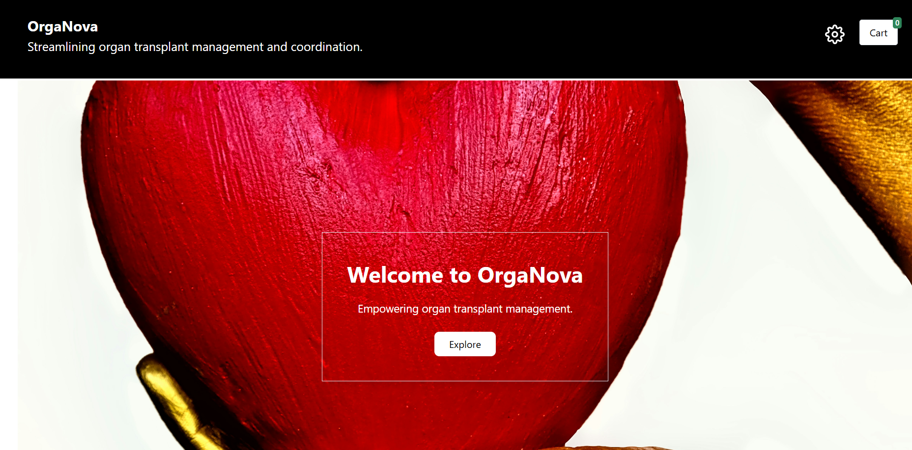
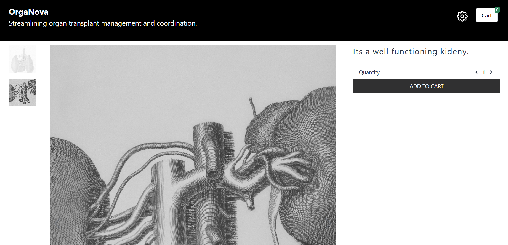

# Organ Transplant Management App

The **Organ Transplant Management App** is a full-stack web application designed to streamline the process of managing organ transplant requests. Built using the MERN stack, the app enables hospitals to list available organs through the admins, allows other hospitals to request transplants, and supports admins in managing approvals efficiently.

## 📑 Table of Contents


- [Features](#features)  
- [Screenshots](#screenshots)  
- [Tech Stack](#tech-stack)  
- [Installation](#installation)  
- [Contributing](#contributing)


## Features

- Hospitals can register and list available organs through the admins along with relevant medical information.
- Hospitals can create accounts and request organs by submitting required health details.
- Admins can review and approve transplant requests.
- Role-based dashboards for hospitals and admins.
- Secure user authentication using JWT tokens.
- RESTful API integration for seamless frontend-backend communication.

## Screenshots


The following screenshot displays the home page of the Organs Transplant Management App. Users can explore available services.


The following screenshot displays the available categories from which users can pick.


The following screenshot displays the details of the particular organ chosen, the user can choose the desired quantity and add to cart.


The following screenshot displays the Cart.


The following screenshot displays the Payment Page.


The following screenshot displays the Admin Dashboard, the Admin can update Categories and add new ones.


The following screenshot displays the Admin Dashboard, the Admin can update Organs and add new ones.


The following screenshot displays the Admin Dashboard, the Admin can view Organs requested by various hospitals, and modify the Organ Status.


## Tech Stack

- **Frontend:** React.js, React Router, TailwindCSS  
- **Backend:** Node.js, Express.js  
- **Database:** MongoDB, Mongoose  
- **Authentication:** JWT, bcrypt  
- **APIs:** RESTful API  

## Installation

1. **Clone the repository:**

```bash
git clone https://github.com/agilan11/organs-transplant-management-app.git
```

2. **Install dependencies for both frontend and backend:**

```bash
cd client
npm install
cd ../server
npm install
```

3. **Create a `.env` file in `/server` with the following:**

```env
DATABASE = your_mongo_connection_string
BRAINTREE_MERCHANT_ID = your_braintree_merchant_id
BRAINTREE_PUBLIC_KEY = your_braintree_public_key
BRAINTREE_PRIVATE_KEY = your_braintree_private_key
JWT_SECRET_KEY = your_jwt_secret_key
ADMIN_EMAIL = admin@gmail.com

```

4. **Create a `.env` file in `/client` with the following:**

```env
REACT_APP_API_URL=http://localhost:<any_empty_port>
```

5. **Run the development servers:**

```bash
# Backend
cd server
npm run start:dev

# Frontend (in a new terminal)
cd client
npm run start
```

## Contributing

1. Fork this repo  
2. Create a branch: `git checkout -b feature-name`  
3. Make your changes and commit: `git commit -m 'Add new feature'`  
4. Push to your fork: `git push origin feature-name`  
5. Open a pull request  
